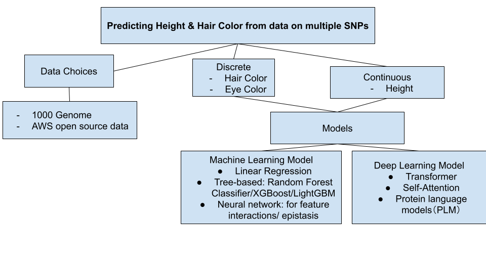

# Combinatorial_mutations
Protein modeling for combinatorial mutations

## Problem

Predicting the phenotype of combinatorial mutations based on single mutation data.
Features: Height, Hair Color

## Dataset
* Source: SNP data
* 1000 Genomes

```{r flowA, echo=FALSE, out.width="90%", fig.align='center'}

```

## Federation -> clients

### Data Preprocessing

* reducing dimensionality

### Model Structure

* Baseline model: Linear Regression
* Ensemble model: Tree-based models (Random Forest Classifier/XGBoost/LightGBM)
* Neural Network: for feature interactions/ epistasis

## Tools


## Implementation

## Usage

* Discrete Phenotype
* Continuous Phenotype

